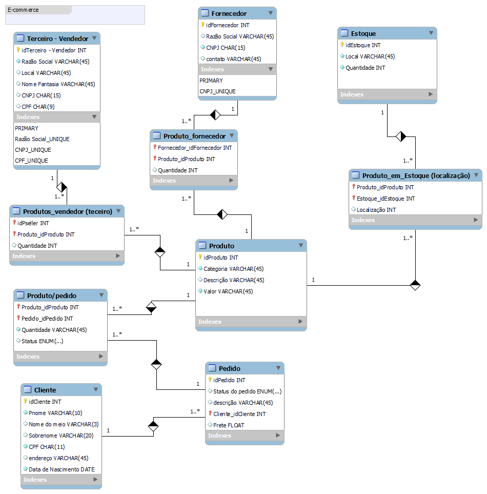
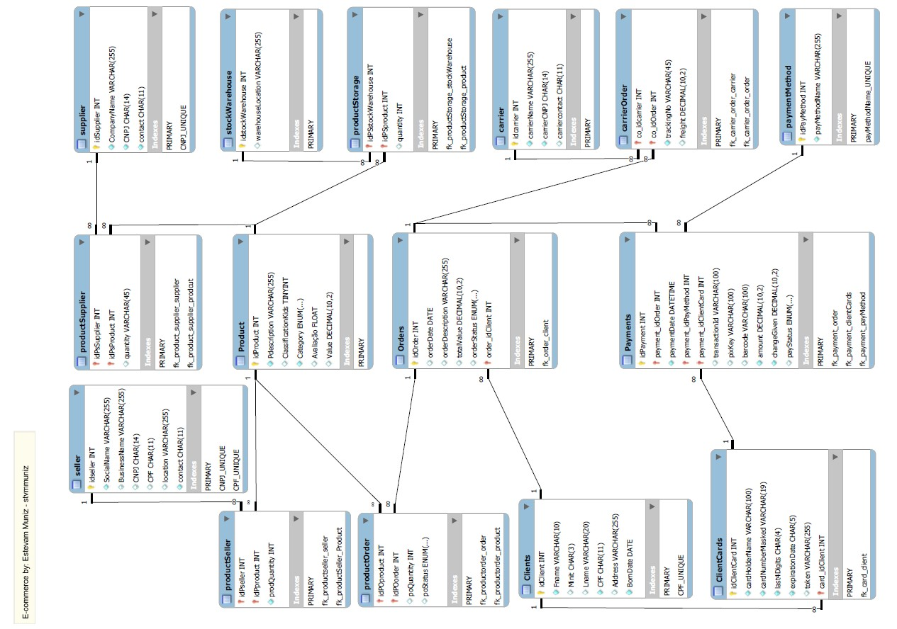

# DIO-Desafio: Construindo seu Primeiro Projeto Lógico de Banco de Dados
Este é um projeto prático de modelagem de banco de dados para atender ao Desafio: Construindo seu Primeiro Projeto Lógico de Banco de Dados, parte integrante o Bootcamp da Klabin - Excel e Power BI Dashboards.

## Contexto Inicial:

Iniciamos o desafio a partir do rascunho de modelagem do banco de dados para uma aplicação de ecommerce desenvolvido nos exercícios das aulas.

A imagem a seguir mostra o estado inicial do modelo de banco de dados:

E abaixo como ficou ao final do desafio:

## Atividades realizadas:
- [X] Adicionado 5 novas tabelas:
    
    * Payments

    * PaymentMethod

    * ClientCards

    * Carrier

    * CarrierOrder

- [X] Cria de relações entre as novas tabelas e as existentes tabelas

- [X] Criação foreign keys

- [X] Criação de novos campos em diversas tabelas

- [X] Criação de novas constraints

- [X] Desenvolvido o Script SQL (Schema) para criação do Banco de Dados MySQL. [Clique aqui para visualizar o arquivo.](schema_sql_stvmmuniz_ecommerce_ver00.sql)

- [X] Desenvolvido o Script SQL para popular as tabelas com dados fictícios para teste. [Clique aqui para visualizar o arquivo.](data_insertion_stvmmuniz_ecommerce_ver00.sql)

- [X] Desenvolvido o Script SQL com Queries para fazer testes e simulações para responder as seguintes perguntas: [Clique aqui para visualizar o arquivo.](queries_sql_stvmmuniz_ecommerce_ver00.sql)

    ##### PERGUNTAS DO DESAFIO:

    *  Quantos pedidos foram feitos por cada cliente?

    *  Algum vendedor também é fonecedor?

    *  Relação de produtos fornecedores e estoques: (Foi acrescentado na consulta o estoque disponível no fornecedor)

    *  Relação de produtos fornecedores ordenado por fornecedor: 

    *  Relação de produtos fornecedores ordenado por produto:

     ##### QUERIES ADICIONAIS PARA:

    *  Lista de pedidos realizados por cliente

    *  Lista de pedidos realizados por cliente - usando JOIN

    *  Lista de produtos comprados por cliente com descrição do fornecedor e agrupado por cliente 

    *  Lista de rastreio dos pedidos enviados e entregues

    *  Ranking de compra dos cliente

    *  Ranking dos vendedores,

- [X] Trabalhado diversos conhecimento estudados neste módulo do curso:

    * Modelo Relacional e Mapeamento ER/Relacional:
        - Conceitos
        - Constraints
        - SGBDs e esquemas relacionais
        - Integridade Referencial e de Entidade
        - Chaves Estrangeiras
        - Mapeando o modelo ER/Relacional
    
    * Linguagem SQL
        - Classificações DDL,DML, DCL, DQL)
        - Statement, Cláusulas, Termos, Constraints)
        - Queries
        - Nomes, Aliasing e Variação de tuplas
        - Expressões, operandos e funções
        - JOIN Statement, CASE Statement
        - Agrupando Registros e Tabelas com JOIN
        - Queries de Mútiplas Tabelas com JOINs
     

### Escrito por stvmmuniz

